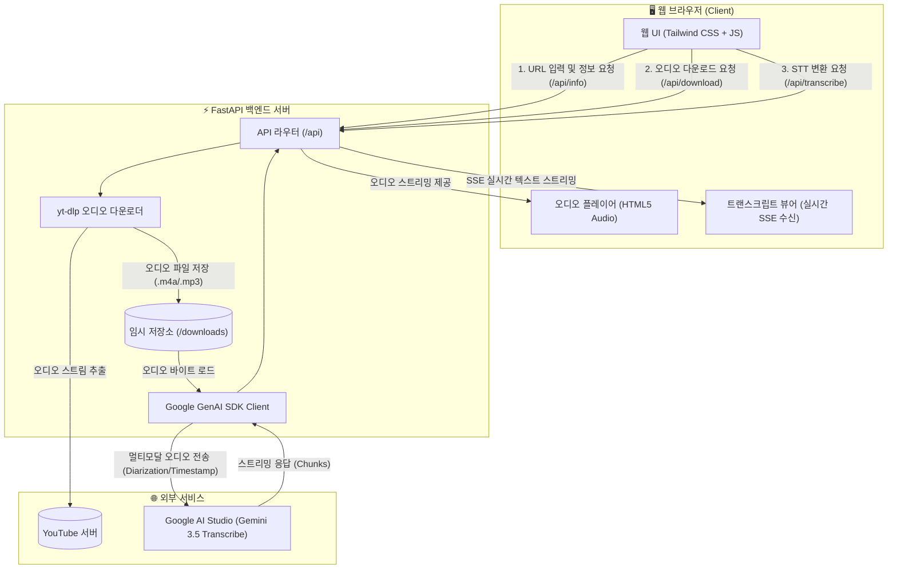
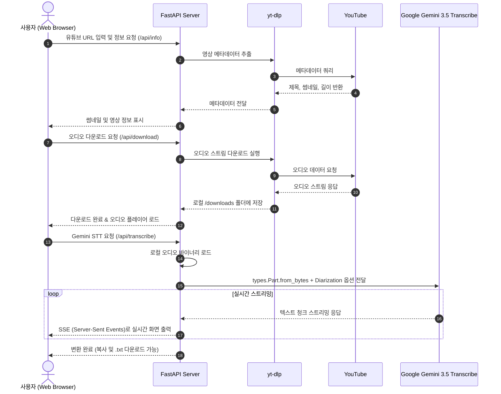

# 🎥 YouTube Audio Downloader & Gemini STT Web Service

유튜브 영상 URL을 입력하면 오디오를 다운로드하고, Google의 최신 **Gemini 3.5 Transcribe** 모델을 활용하여 실시간 스트리밍으로 트랜스크립트(자막/대본)를 추출해 주는 웹 애플리케이션입니다.

---

## 🏗️ 서비스 아키텍처 (Architecture)

### 1. 시스템 구성도 (System Architecture)



---

### 2. 데이터 흐름 시퀀스 (Data Flow Sequence)



---

## ✨ 주요 기능

1. **YouTube 영상 정보 조회 및 오디오 다운로드**:
   - `yt-dlp`를 통해 영상 제목, 썸네일, 길이 등을 미리보기로 제공
   - 최고 품질의 오디오 스트림을 자동 다운로드
2. **웹 오디오 플레이어**:
   - 추출된 오디오 파일을 웹 브라우저에서 즉시 재생 및 탐색 가능
3. **Gemini 3.5 Transcribe 음성 인식 (STT)**:
   - 화자 분리 (Diarization: Speaker 구분)
   - 단어별 정밀 타임스탬프 (Word Timestamp)
   - 실시간 SSE(Server-Sent Events) 스트리밍 출력
4. **편의 기능**:
   - 추출된 전체 텍스트 원클릭 클립보드 복사
   - 영상 제목 기반 `.txt` 파일 다운로드

---

## 🚀 빠른 시작 가이드

### 1. 가상환경 활성화 및 필수 패키지 설치
```bash
conda activate myenv

cd /Users/sohyunkim/Desktop/Project/GoogleAIstudio_Tutorial/youtube_stt_service
pip install -r requirements.txt
```

### 2. Gemini API Key 환경변수 확인
```bash
export GEMINI_API_KEY="your_api_key_here"
```

### 3. 웹 서버 실행
```bash
python app.py
```
또는
```bash
uvicorn app:app --reload --host 0.0.0.0 --port 8000
```

### 4. 웹 브라우저 접속
브라우저에서 아래 주소로 접속합니다:
👉 **`http://localhost:8000`**

---

## 🛠️ 기술 스택
- **Backend**: FastAPI, Uvicorn, yt-dlp, Google GenAI SDK (`gemini-3.5-transcribe`)
- **Frontend**: HTML5, Tailwind CSS, Lucide Icons, Vanilla JavaScript (SSE Reader)
